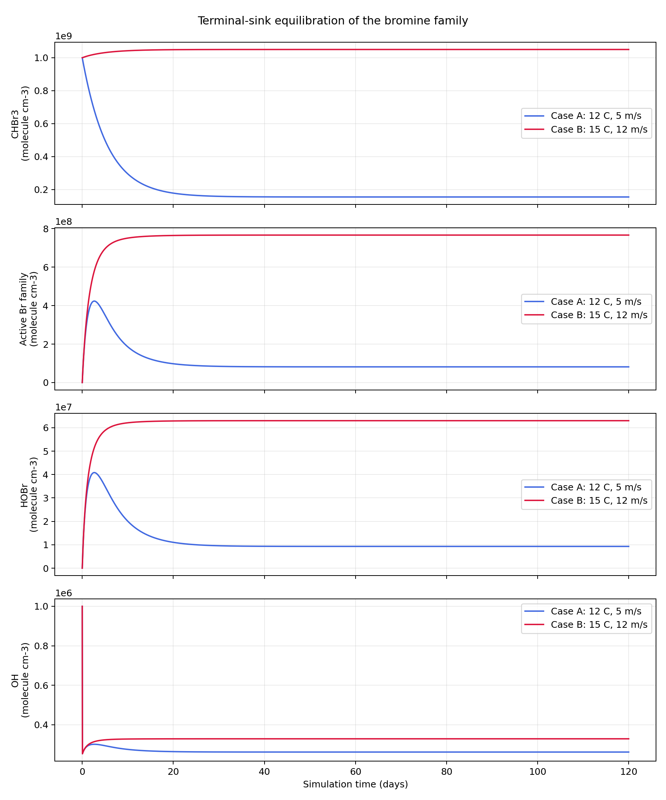

# Marine Halogen Boundary-Layer Box Model

This Python application is a stiff, zero-dimensional marine boundary-layer
chemistry model for bromoform (CHBr3), atomic bromine, bromine monoxide, HOBr,
HO2, and OH. It is designed for mechanism auditing and controlled scenario
comparison rather than atmospheric forecasting.

The model couples a temperature-dependent conceptual ocean source to CHBr3
photolysis, reactive bromine cycling, prescribed HOx production and loss, and
first-order HOBr deposition/washout. SciPy's implicit Radau solver integrates
the resulting ODE system.

## Scientific question

Under continuous marine CHBr3 forcing:

- How does reactive bromine partition among Br, BrO, and HOBr?
- Does a terminal HOBr sink permit a true steady state?
- How do a cold, moderate-wind case and a warmer, high-wind marine-anomaly
  case differ after both systems equilibrate?

## State vector

- CHBr3 gas
- Br radical
- BrO radical
- HO2 radical
- OH radical
- HOBr reservoir

All atmospheric state variables use `molecule cm-3`; time uses seconds.

## Governing equations

The reaction-rate shorthand is:

$$
L_{\mathrm{CHBr_3}}
= \left(J_{\mathrm{CHBr_3}}
+ k_{\mathrm{OH+CHBr_3}}[\mathrm{OH}]
+ k_{\mathrm{Cl+CHBr_3}}[\mathrm{Cl}]\right)[\mathrm{CHBr_3}],
$$

$$
R_{\mathrm{BrO}}=k_{\mathrm{Br+O_3}}[\mathrm{Br}][\mathrm{O_3}],
$$

$$
R_{\mathrm{HOBr}}
=k_{\mathrm{BrO+HO_2}}[\mathrm{BrO}][\mathrm{HO_2}],
$$

$$
P_{\mathrm{HOBr}}=J_{\mathrm{HOBr}}[\mathrm{HOBr}],
\qquad
D_{\mathrm{HOBr}}=k_{\mathrm{term}}[\mathrm{HOBr}].
$$

The state tendencies are:

$$
\frac{d[\mathrm{CHBr_3}]}{dt}
=S_{\mathrm{ocean}}-L_{\mathrm{CHBr_3}},
$$

$$
\frac{d[\mathrm{Br}]}{dt}
=3J_{\mathrm{CHBr_3}}[\mathrm{CHBr_3}]
+P_{\mathrm{HOBr}}-R_{\mathrm{BrO}},
$$

$$
\frac{d[\mathrm{BrO}]}{dt}=R_{\mathrm{BrO}}-R_{\mathrm{HOBr}},
$$

$$
\frac{d[\mathrm{HO_2}]}{dt}
=P_{\mathrm{HOx}}-R_{\mathrm{HOBr}}-k_{\mathrm{HO_2}}[\mathrm{HO_2}],
$$

$$
\frac{d[\mathrm{OH}]}{dt}
=P_{\mathrm{HOx}}+P_{\mathrm{HOBr}}-k_{\mathrm{OH}}[\mathrm{OH}],
$$

$$
\frac{d[\mathrm{HOBr}]}{dt}
=R_{\mathrm{HOBr}}-P_{\mathrm{HOBr}}-D_{\mathrm{HOBr}}.
$$

The terminal-loss constant is:

$$
k_{\mathrm{term}}=1.0\times10^{-4}\ \mathrm{s^{-1}},
$$

equivalent to an HOBr lifetime of approximately 2.78 hours. Summing Br, BrO,
and HOBr gives the active-bromine budget:

$$
\frac{d([\mathrm{Br}]+[\mathrm{BrO}]+[\mathrm{HOBr}])}{dt}
=3J_{\mathrm{CHBr_3}}[\mathrm{CHBr_3}]
-k_{\mathrm{term}}[\mathrm{HOBr}].
$$

This identity is regression-tested.

## Scenarios

| Case | SST | Air temperature | Wind speed |
| --- | ---: | ---: | ---: |
| A: cold baseline | 12 deg C | 12 deg C | 5 m s-1 |
| B: marine anomaly | 15 deg C | 15 deg C | 12 m s-1 |

Both runs start from the same atmospheric concentrations. The experiment
integrates 120 days with hourly output.

## Steady-state criterion

A case is reported as converged only when every state variable has an
absolute fractional drift no greater than `1.0e-4` per hour and remains below
that threshold through the end of the integration. A visually flat trace by
itself is not treated as proof of steady state.

Verified results:

| Diagnostic | Case A | Case B |
| --- | ---: | ---: |
| First sustained convergence | 34.9167 days | 12.75 days |
| Active Br family at equilibrium | 8.1696e7 molecule cm-3 | 7.6640e8 molecule cm-3 |
| OH at equilibrium | 2.6162e5 molecule cm-3 | 3.2877e5 molecule cm-3 |
| HOBr deposition rate | 929.684 molecule cm-3 s-1 | 6301.288 molecule cm-3 s-1 |
| CHBr3 photolytic Br production | 929.684 molecule cm-3 s-1 | 6301.288 molecule cm-3 s-1 |

The equilibrated OH concentration is 25.665% higher in Case B. Neither case
is equilibrated after only 24 hours.



## Run

```powershell
cd G:\in_your_dreams\Halogens
python -m venv .venv
.\.venv\Scripts\Activate.ps1
python -m pip install -e ".[dev]"
halogens-run
pytest
```

Outputs are written to `outputs/`:

- `summary.txt`: convergence and equilibrium diagnostics
- `radical_trends.png`: CHBr3, active bromine, HOBr, and OH time series
- `cold_baseline.csv`: complete Case A trajectory
- `marine_anomaly.csv`: complete Case B trajectory

The CSV files are generated locally and excluded from version control.

## Important scope

This remains a conceptual box model.

- The ocean-source conversion is a prototype scaling, not a dimensionally
  complete air-sea transfer parameterization.
- O3, Cl, and the HOx source are prescribed rather than prognostic.
- The HO2 and OH background losses are configurable pseudo-first-order terms.
- The selected HOBr deposition rate is a modeling assumption within the
  stated soluble-gas lifetime range, not a site-specific retrieval.
- There is no vertical structure, transport, cloud microphysics, aerosol
  chemistry, diurnal photolysis, or meteorological feedback.

Use the model for numerical experiments and mechanism development, not as a
validated abundance, emission, or climate-forcing estimate. Scientific
sources are listed in [`SOURCES.md`](SOURCES.md), and the remediation history
is recorded in [`ERROR_LOG.md`](ERROR_LOG.md).
